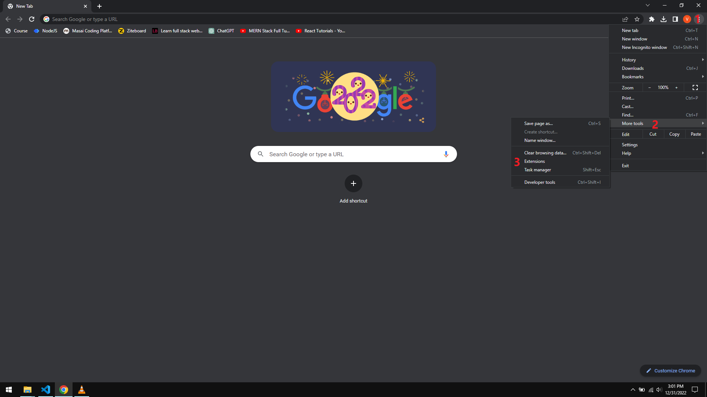
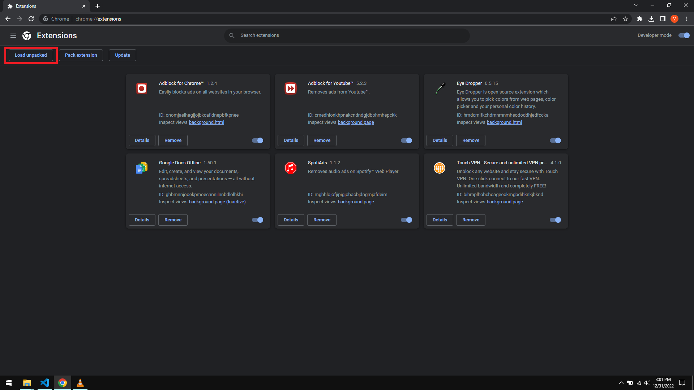
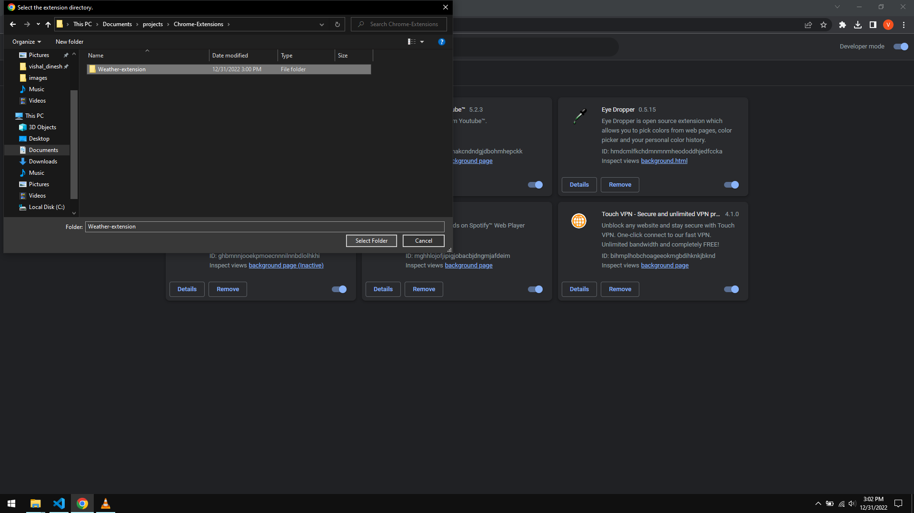
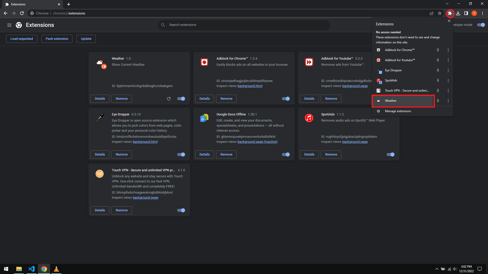
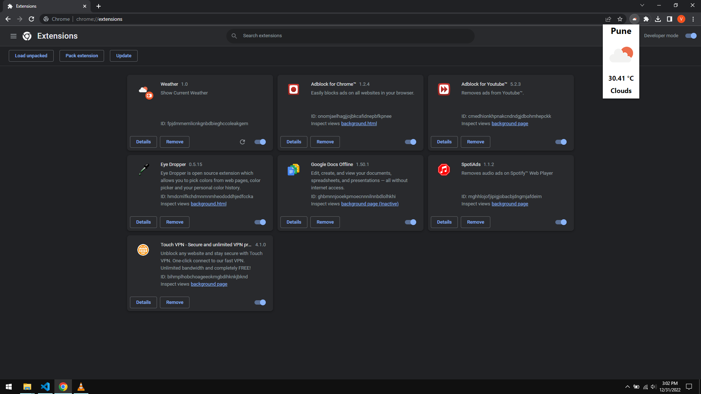

# Chrome Weather Extension

A chrome extension that shows the current weather in your city

## How to Use :

To use the extension, turn on "Developer Mode" in your chrome extensions tab, clone this project and click on "Load Unpacked" & select this project folder.

To see the weather just click the extension on your top right section of your address bar

## Steps :

1: Click options, select more tools and select Extensions from there

  
2: Click load unpacked

  
3: Browse and select the downloaded folder

  
3: Browse and select the downloaded folder

  
4: Final Output will look something like this:

  
